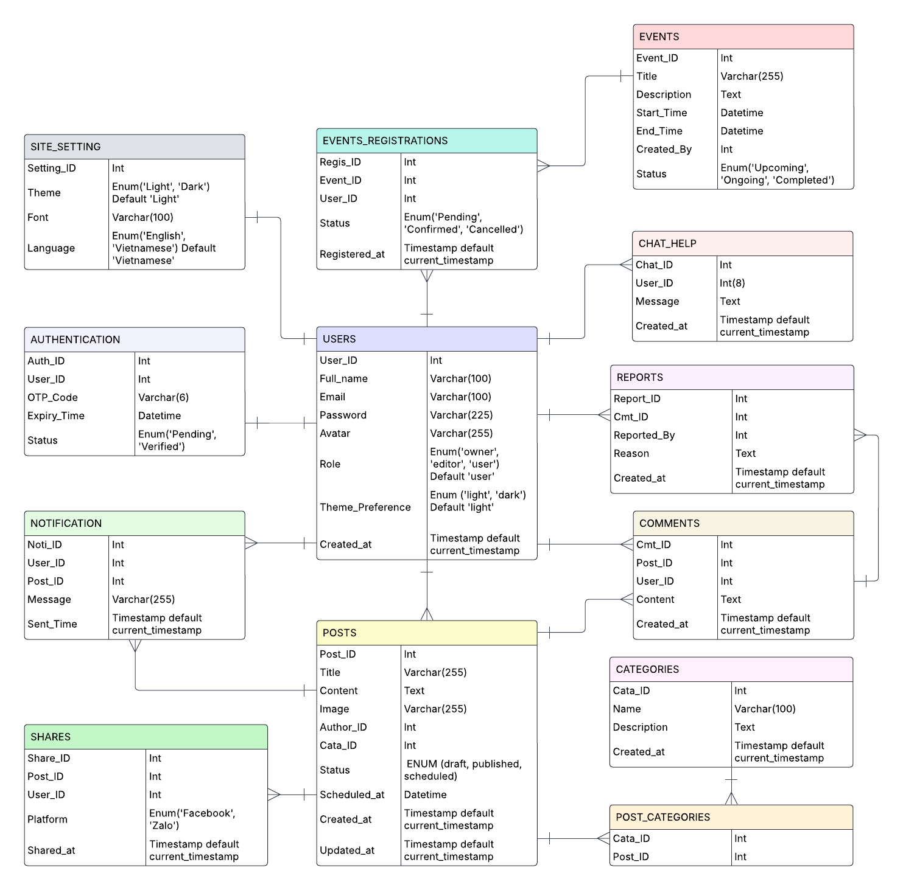
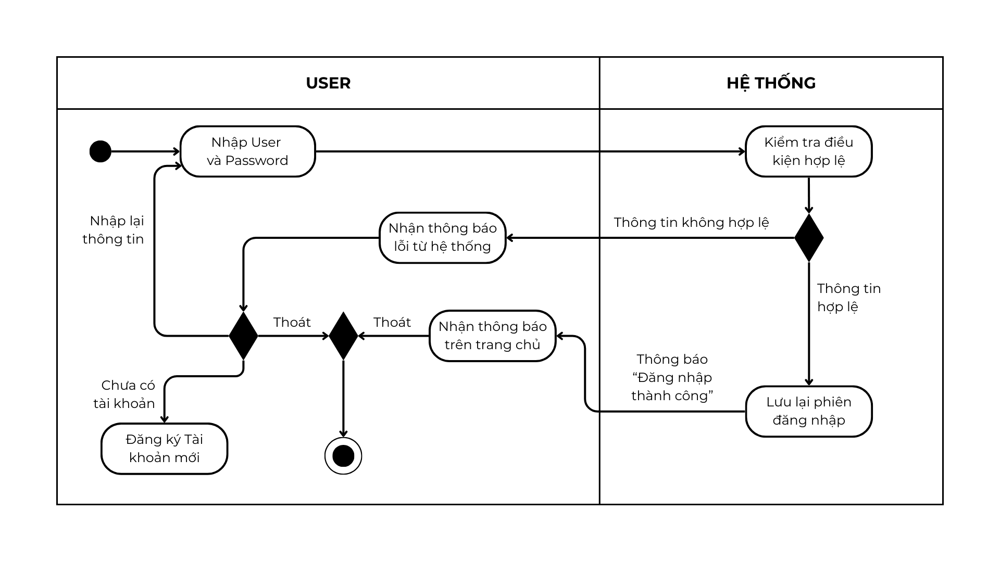
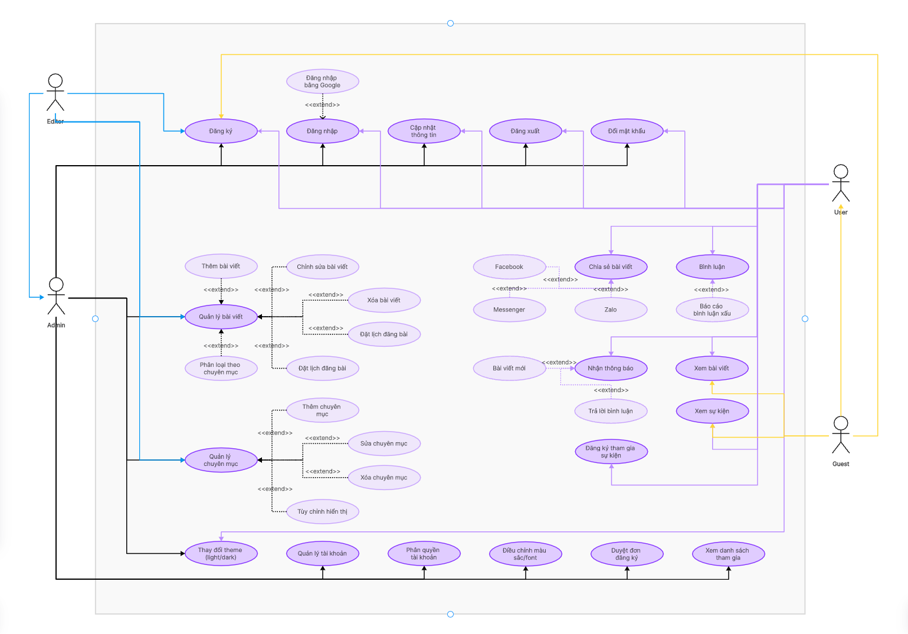

# NT208.P24 - LẬP TRÌNH ỨNG DỤNG WEB

_**Lời ngỏ:**_ _Chào mừng quý thầy cô và các bạn đến với trang web đầu tiên của nhóm 4! Đây là sản phẩm mà cả nhóm đã cùng nhau lên ý tưởng, xây dựng và hoàn thiện với tất cả sự tâm huyết. Chúng mình hy vọng rằng trang web này sẽ mang lại những trải nghiệm hữu ích và thú vị cho mọi người._
_Dù đã cố gắng hết sức, nhưng chắc chắn không thể tránh khỏi những thiếu sót. Nhóm rất mong nhận được những góp ý chân thành từ quý thầy cô và các bạn để có thể cải thiện và phát triển sản phẩm ngày càng tốt hơn. Sự ủng hộ và đóng góp của mọi người chính là động lực lớn nhất để nhóm tiếp tục học hỏi và hoàn thiện hơn trong những dự án tiếp theo._
_Một lần nữa, nhóm 4 xin chân thành cảm ơn! ❤️_

---

## 📋 MỤC LỤC

1. [Thông tin đồ án](#i-thông-tin-đồ-án)
2. [Danh sách thành viên](#ii-danh-sách-thành-viên)
3. [Cấu trúc dự án](#iii-cấu-trúc-dự-án)
4. [Tính năng chính](#iv-tính-năng-chính)
5. [API và Database](#v-api-và-database)
6. [Công nghệ sử dụng](#vi-công-nghệ-sử-dụng)
7. [Hướng dẫn cài đặt](#vii-hướng-dẫn-cài-đặt)
8. [Các vấn đề và giải pháp](#viii-các-vấn-đề-và-giải-pháp)
9. [Kế hoạch phát triển](#ix-kế-hoạch-phát-triển)

---

## I. THÔNG TIN ĐỒ ÁN

**Tên đề tài:** Website Giới thiệu tổ chức Đoàn khoa Mạng máy tính và Truyền thông

**Mô tả:** Xây dựng website giới thiệu và quản lý hoạt động của Đoàn khoa MMT&TT, hỗ trợ sinh viên cập nhật thông tin, tham gia hoạt động và đặt phòng.

### 📊 Sơ đồ thiết kế hệ thống

_**1. Database Schema:**_


_**2. Login Activities Flow:**_


_**3. Use Case Diagram:**_


---

## II. DANH SÁCH THÀNH VIÊN

| STT | Họ và tên | MSSV | Vai trò | Đóng góp chính |
|-----|----------------|------|---------|----------------|
| 1 | Hoàng Bảo Phước | 23521231 | Leader | Front End Development, Project Management |
| 2 | Nguyễn Đình Khang | 23520694 | Member | UI/UX Design, Frontend Development, Product Integration |
| 3 | Đỗ Quang Trung | 23521673 | Member | Backend Development, Quality Assurance, Testing |

---

## III. CẤU TRÚC DỰ ÁN

```
NT208.P24/
├── 📁 src/
│   ├── 📁 app/                          # Next.js App Router
│   │   ├── 📁 Activities/               # Trang hoạt động
│   │   │   ├── 📁 [slug]/              # Chi tiết hoạt động [SLUG ROUTING]
│   │   │   │   └── page.jsx            # Activity detail page
│   │   │   ├── page.jsx                # Activities main page
│   │   │   └── activity-detail.css     # Styling cho detail page
│   │   │
│   │   ├── 📁 ActivitiesOverview/       # Tổng quan hoạt động
│   │   │   └── page.jsx
│   │   │
│   │   ├── 📁 api/                      # API Routes
│   │   │   ├── 📁 activities/          # Activities API
│   │   │   │   ├── 📁 [slug]/          # Dynamic route cho activity
│   │   │   │   │   ├── 📁 comments/    # Comments API cho activity
│   │   │   │   │   │   └── route.js    # GET, POST comments
│   │   │   │   │   └── route.js        # GET, PUT, DELETE activity
│   │   │   │   ├── route.js            # GET, POST activities
│   │   │   │   └── update-slugs/       # Utility để update slugs
│   │   │   │       └── route.js
│   │   │   │
│   │   │   ├── 📁 auth/                # Authentication API
│   │   │   │   ├── login/
│   │   │   │   ├── register/
│   │   │   │   └── verify/
│   │   │   │
│   │   │   ├── 📁 booking/             # Booking API
│   │   │   └── 📁 users/               # User management API
│   │   │
│   │   ├── 📁 admin/                    # Admin Dashboard
│   │   │   ├── 📁 ActivitiesDashboard/ # Quản lý hoạt động
│   │   │   │   ├── page.jsx            # Main dashboard
│   │   │   │   └── style.css           # Dashboard styling
│   │   │   ├── 📁 UsersDashboard/      # Quản lý users
│   │   │   │   └── page.jsx
│   │   │   └── 📁 comments/            # Comments management API
│   │   │       ├── 📁 [commentId]/     # Individual comment actions
│   │   │       │   └── route.js        # PUT, DELETE comment
│   │   │       └── route.js            # GET, DELETE comments
│   │   │
│   │   ├── 📁 Booking/                  # Đặt phòng
│   │   │   └── page.jsx
│   │   │
│   │   ├── 📁 Introduction/             # Giới thiệu
│   │   │   └── page.jsx
│   │   │
│   │   ├── 📁 Profile/                  # Trang cá nhân
│   │   │   ├── page.jsx                # Profile management
│   │   │   ├── layout.jsx              # Profile layout
│   │   │   └── style.css               # Profile styling
│   │   │
│   │   ├── 📁 User/                     # Login/Register
│   │   │   └── page.jsx
│   │   │
│   │   ├── layout.js                   # Root layout
│   │   ├── page.js                     # Homepage
│   │   └── globals.css                 # Global styles
│   │
│   ├── 📁 components/                   # Reusable Components
│   │   ├── 📁 Comments/                # Comment system
│   │   │   ├── CommentSection.jsx      # Main comment component
│   │   │   ├── CommentList.jsx         # Display comments
│   │   │   ├── CommentForm.jsx         # Comment input form
│   │   │   └── style.css               # Comment styling
│   │   │
│   │   ├── 📁 Footer/                  # Footer component
│   │   ├── 📁 Header/                  # Header component
│   │   ├── 📁 HeaderAdmin/             # Admin header
│   │   └── 📁 NotificationBell/        # Notification system
│   │       └── index.jsx
│   │
│   ├── 📁 context/                      # React Context
│   │   └── SessionContext.jsx          # User session management
│   │
│   ├── 📁 lib/                          # Utilities
│   │   └── mongodb.js                  # Database connection
│   │
│   ├── 📁 models/                       # Database Models
│   │   ├── Activity.js                 # Activity schema & types
│   │   ├── User.js                     # User schema
│   │   ├── Notification.js             # Notification schema
│   │   └── Comment.js                  # Comment schema
│   │
│   └── 📁 styles-comp/                  # Component styles
│       └── style.css                   # Global component styles
│
├── 📁 public/                          # Static assets
│   └── 📁 Img/                         # Images
│       ├── 📁 Activities/              # Activity images
│       ├── 📁 GitHub/                  # Documentation images
│       └── 📁 [other-assets]/
│
├── 📄 README.md                        # Documentation
├── 📄 package.json                     # Dependencies
├── 📄 next.config.js                   # Next.js config
└── 📄 .env.local                       # Environment variables
```

### 🔑 Key Architecture Features

- **Dynamic Routing:** [`[slug]`](src/app/Activities/[slug]/page.jsx) cho activity details
- **API Routes:** RESTful API với Next.js App Router
- **Component Structure:** Modular components với reusable logic
- **Database Models:** MongoDB schemas với Mongoose
- **Context Management:** [`SessionContext`](src/context/SessionContext.jsx) cho user state

---

## IV. TÍNH NĂNG CHÍNH

### 🏠 Trang Chủ
- **Tổng quan website**:
  - Hiển thị cấu trúc tổng quan của website.
  - Cung cấp thông tin nổi bật về Đoàn khoa Mạng máy tính và Truyền thông.
- **Tin tức và hoạt động nổi bật**:
  - Carousel hiển thị các hoạt động gần đây và sự kiện nổi bật.
  - Tóm tắt thành tích đạt được trong thời gian qua.
- **Giới thiệu tóm tắt**:
  - Thông tin về Đoàn khoa và các ban trực thuộc (Ban Học tập, Ban Truyền thông và Sự kiện, Ban Thiết kế).
  - Hình ảnh minh họa các hoạt động gần đây.

### 📖 Giới thiệu
- **Thông tin Đoàn khoa**:
  - Tổng quan về lịch sử hình thành và mô hình tổ chức.
  - Vai trò và chức năng của các ban trực thuộc:
    - Ban Học tập.
    - Ban Truyền thông và Sự kiện.
    - Ban Thiết kế.
- **Giao diện**:
  - Hiển thị nội dung rõ ràng, dễ đọc.
  - Hình ảnh sắc nét, bố cục thân thiện.

### 📰 Hoạt động
- **Danh sách hoạt động**:
  - **Hoạt động gần đây**:
    - Liệt kê các sự kiện mới nhất do Đoàn khoa tổ chức.
    - Hiển thị danh sách theo dạng carousel hoặc danh sách cuộn.
  - **Hoạt động nổi bật**:
    - Liệt kê các chương trình trọng điểm, có sức ảnh hưởng lớn.
    - Bao gồm hình ảnh, nội dung mô tả, và thông tin chi tiết.
- **Chi tiết hoạt động**:
  - Dynamic routing với slug để truy cập chi tiết từng hoạt động.
  - Hiển thị nội dung đầy đủ với tiêu đề, hình ảnh, tác giả, ngày đăng.
  - Hỗ trợ badge phân loại hoạt động (17 loại).
- **Tương tác**:
  - Hệ thống bình luận:
    - Người dùng có thể để lại bình luận dưới bài viết.
    - Hỗ trợ báo cáo bình luận xấu.
  - Chia sẻ bài viết lên các nền tảng: Facebook, Twitter, LinkedIn, Zalo.

### 🏆 Thành tích
- **Danh sách thành tích**:
  - Liệt kê các giải thưởng, thành tựu theo từng năm.
  - Hiển thị hình ảnh và bài viết vinh danh cá nhân/tập thể xuất sắc.
- **Giao diện**:
  - Bố cục rõ ràng, dễ đọc trên mọi thiết bị.
  - Tích hợp hình ảnh minh họa và nội dung chi tiết.

### 🏢 Đặt phòng
- **Hệ thống đặt phòng**:
  - Biểu mẫu đăng ký đặt phòng sinh hoạt Chi đoàn hoặc họp lớp.
  - Multi-step form với validation.
  - Lựa chọn phòng và thời gian tổ chức.
  - Yêu cầu chấp nhận điều khoản trước khi gửi đăng ký.
- **Quản lý đăng ký**:
  - Quản trị viên duyệt đơn đăng ký.
  - Quản lý danh sách đăng ký.

### 📞 Liên hệ
- **Kênh liên hệ**:
  - Cung cấp thông tin liên hệ chính thức: Email, Facebook.
  - Form liên hệ để sinh viên gửi ý kiến hoặc kết nối với Đoàn khoa.
- **Giao diện**:
  - Bố cục đơn giản, dễ truy cập.
  - Hỗ trợ responsive trên các thiết bị.

### 🛠️ Admin Dashboard
- **Quản lý hoạt động**:
  - **CRUD operations**:
    - Tạo, đọc, cập nhật, xóa các bài viết hoạt động.
  - **Batch operations**:
    - Hỗ trợ chọn và xử lý nhiều hoạt động cùng lúc.
  - **Image upload**:
    - Tải lên hình ảnh với tính năng xem trước.
  - **Status management**:
    - Quản lý trạng thái bài viết: draft/published.
  - **Activity types**:
    - Hỗ trợ 17 loại hoạt động với badge phân loại.
- **Quản lý thành tích**:
  - Tạo, chỉnh sửa, xóa các bài viết về thành tích.
  - Quản lý danh sách giải thưởng và bài viết vinh danh.
- **Quản lý người dùng**:
  - **Phân quyền**:
    - Owner/Admin: Toàn quyền quản lý website, nội dung, và phân quyền.
    - Editor: Đăng bài, chỉnh sửa bài viết, không có quyền quản trị hệ thống.
    - User: Chỉ có thể bình luận và chia sẻ bài viết.
  - **Quản lý tài khoản**:
    - Duyệt tài khoản người dùng.
    - Quản lý thông tin cá nhân: tên, email, avatar, vai trò.
  - **Đăng nhập/Đăng ký**:
    - Hỗ trợ đăng nhập qua Google.
    - Quản lý tài khoản cá nhân.
- **Quản lý tin nhắn (Bình luận)**:
  - **Real-time monitoring**:
    - Theo dõi tất cả bình luận trên các bài viết hoạt động.
  - **Moderation tools**:
    - Chỉnh sửa, xóa, hoặc xử lý hàng loạt bình luận.
  - **Activity linking**:
    - Điều hướng đến bài viết chứa bình luận để kiểm tra ngữ cảnh.

---

## V. API VÀ DATABASE

### 🗃️ Database Models

#### Activity Schema ([`models/Activity.js`](src/models/Activity.js))
```javascript
{
  title: String,              // Tiêu đề
  slug: String,               // URL-friendly identifier
  content: String,            // Nội dung chính
  author: String,             // Tác giả
  type: String,               // Loại hoạt động (17 types)
  image: String,              // URL hình ảnh
  status: String,             // published/draft
  commentOption: String,      // open/closed
  comments: [{               // Embedded comments
    _id: ObjectId,
    content: String,
    author: String,
    authorEmail: String,
    replyTo: ObjectId,        // For nested replies
    createdAt: Date,
    updatedAt: Date
  }],
  createdAt: Date,
  updatedAt: Date
}
```

#### User Schema ([`models/User.js`](src/models/User.js))
```javascript
{
  name: String,
  email: String,
  password: String,           // Hashed
  role: String,               // user/admin
  avatar: String,             // Base64 hoặc URL
  createdAt: Date,
  updatedAt: Date
}
```

### 🔌 API Endpoints

#### Activities API
| Method | Endpoint | File | Mô tả |
|--------|----------|------|-------|
| GET | `/api/activities` | [`route.js`](src/app/api/activities/route.js) | Lấy danh sách hoạt động |
| POST | `/api/activities` | [`route.js`](src/app/api/activities/route.js) | Tạo hoạt động mới |
| GET | `/api/activities/[slug]` | [`[slug]/route.js`](src/app/api/activities/[slug]/route.js) | Lấy chi tiết hoạt động |
| PUT | `/api/activities/[slug]` | [`[slug]/route.js`](src/app/api/activities/[slug]/route.js) | Cập nhật hoạt động |
| DELETE | `/api/activities/[slug]` | [`[slug]/route.js`](src/app/api/activities/[slug]/route.js) | Xóa hoạt động |

#### Comments API
| Method | Endpoint | File | Mô tả |
|--------|----------|------|-------|
| GET | `/api/activities/[slug]/comments` | [`comments/route.js`](src/app/api/activities/[slug]/comments/route.js) | Lấy comments của activity |
| POST | `/api/activities/[slug]/comments` | [`comments/route.js`](src/app/api/activities/[slug]/comments/route.js) | Thêm comment mới |

#### Admin API
| Method | Endpoint | File | Mô tả |
|--------|----------|------|-------|
| GET | `/api/admin/comments` | [`admin/comments/route.js`](src/app/admin/comments/route.js) | Lấy tất cả comments |
| DELETE | `/api/admin/comments` | [`admin/comments/route.js`](src/app/admin/comments/route.js) | Xóa comment |
| PUT | `/api/admin/comments/[commentId]` | [`[commentId]/route.js`](src/app/admin/comments/[commentId]/route.js) | Cập nhật comment |
| DELETE | `/api/admin/comments/[commentId]` | [`[commentId]/route.js`](src/app/admin/comments/[commentId]/route.js) | Xóa comment cụ thể |

---

## VI. CÔNG NGHỆ SỬ DỤNG

### 🛠️ Frontend Technologies
- **Framework:** Next.js 14 (App Router)
- **Language:** JavaScript/JSX
- **Styling:** CSS3, CSS Modules
- **UI:** Custom components, responsive design
- **State Management:** React Hooks, Context API

### ⚙️ Backend Technologies
- **Runtime:** Node.js
- **Framework:** Next.js API Routes
- **Database:** MongoDB với Mongoose ODM
- **Authentication:** JWT tokens
- **File Handling:** Base64 encoding cho images

### 📦 Key Dependencies
```json
{
  "next": "^14.0.0",
  "react": "^18.0.0",
  "mongoose": "^8.0.0",
  "bcryptjs": "^2.4.3",
  "jsonwebtoken": "^9.0.0"
}
```

---

## VII. HƯỚNG DẪN CÀI ĐẶT

### 📋 Yêu cầu hệ thống
- Node.js 18+
- MongoDB 5+
- Git

### 🚀 Cài đặt và chạy dự án

```bash
# Clone repository
git clone [repository-url]
cd NT208.P24

# Cài đặt dependencies
npm install

# Cấu hình environment variables
cp .env.example .env.local
# Cập nhật MONGODB_URI và JWT_SECRET

# Chạy development server
npm run dev

# Mở trình duyệt tại http://localhost:3000
```

### ⚙️ Environment Variables
```env
MONGODB_URI=mongodb://localhost:27017/nt208
JWT_SECRET=your-jwt-secret
NEXT_PUBLIC_API_URL=http://localhost:3000
```

---

## VIII. CÁC VẤN ĐỀ VÀ GIẢI PHÁP

### 🐛 Issues đã được giải quyết

#### 1. **Dynamic Routing Problems**
**Vấn đề:** Activities detail page không load được với slug

**Giải pháp:** 
- Implement proper slug generation trong [`Activity model`](src/models/Activity.js)
- Use Next.js [`[slug]` routing](src/app/Activities/[slug]/page.jsx)
- Add slug update utility: [`update-slugs route`](src/app/api/activities/update-slugs/route.js)

#### 2. **Comment System Architecture**
**Vấn đề:** Nested comments và real-time updates

**Giải pháp:**
- Embedded comments trong Activity schema
- Tree structure organization trong [`CommentList.jsx`](src/components/Comments/CommentList.jsx)
- Proper state management với React hooks

#### 3. **Image Upload & Optimization**
**Vấn đề:** Large image files causing performance issues

**Giải pháp:**
- Base64 encoding với compression trong [`Profile/page.jsx`](src/app/Profile/page.jsx)
- Canvas-based image resizing
- File size validation (5MB limit)

#### 4. **Admin Dashboard Performance**
**Vấn đề:** Slow loading với large datasets

**Giải pháp:**
- Pagination trong [`admin comments API`](src/app/admin/comments/route.js)
- Batch operations trong [`ActivitiesDashboard`](src/app/admin/ActivitiesDashboard/page.jsx)
- Lazy loading và virtualization

### ⚠️ Known Limitations

#### 1. **Authentication System**
- **Issue:** Chưa có refresh token mechanism
- **Impact:** Users cần re-login thường xuyên
- **Workaround:** Extended JWT expiry time

#### 2. **File Storage**
- **Issue:** Images stored as Base64 trong database
- **Impact:** Database size tăng nhanh
- **Planned:** Migration to cloud storage (Cloudinary/AWS S3)

#### 3. **Real-time Features**
- **Issue:** Comments không update real-time
- **Impact:** Users cần refresh để thấy comments mới
- **Planned:** WebSocket integration

#### 4. **Mobile Responsiveness**
- **Issue:** Admin dashboard chưa fully responsive
- **Impact:** Difficult to use trên mobile devices
- **In Progress:** CSS media queries optimization

### 🔧 Technical Debt

#### 1. **Code Organization**
```javascript
// Current: Mixed logic trong components
// TODO: Extract business logic to custom hooks
// TODO: Implement proper error boundaries
```

#### 2. **Database Optimization**
```javascript
// Current: Embedded comments trong activities
// TODO: Separate comments collection với population
// TODO: Add database indexing cho better performance
```

#### 3. **API Error Handling**
```javascript
// Current: Basic try-catch
// TODO: Standardized error response format
// TODO: Proper HTTP status codes
```
---

## 🤝 ĐÓNG GÓP

### Development Workflow
1. Fork repository
2. Create feature branch (`git checkout -b feature/AmazingFeature`)
3. Follow coding standards
4. Write tests for new features
5. Commit changes (`git commit -m 'Add some AmazingFeature'`)
6. Push to branch (`git push origin feature/AmazingFeature`)
7. Open Pull Request

### Coding Standards
- Use ESLint configuration
- Follow Next.js best practices
- Write clear comments cho complex logic
- Implement proper error handling

---

## 📞 LIÊN HỆ

- **Email nhóm:** 23521231@gm.uit.edu.vn
- **Documentation:** [README.md](README.md)
- **Project Demo:** [Live Demo](nt208p24.vercel.app)

---

**© 2025 Nhóm 4 - NT208.P24. All rights reserved.**

*Last updated: June 2025*
